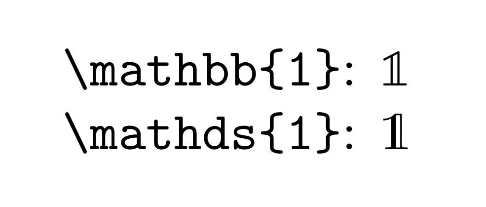

The other day, whilst typesetting some number-theory notes, I needed to mention a characteristic function. A characteristic/indicator function is a function $𝟙_A: X \subseteq A \to \{0, 1\}$ given by

$$
𝟙_A(x) \colonequals \begin{cases}
1 & \text{if } x \in A, \\
0 & \text{if } x \notin A.
\end{cases}
$$

What is the problem? Obviously, there is no issue in conveying the idea, so that will not be the subject of this post. Instead, I want to bring up the problem of the symbol used to represent the function. The $\LaTeX$ `amssymb` package features the `\mathbb` function for a blackboard bold typeface. Unfortunately, we only get capital letters (and lowercase 'k').

The way I used a blackboard bold one above was with Unicode, which gives us all of the numbers: 𝟘, 𝟙, 𝟚, 𝟛, 𝟜, 𝟝, 𝟞, 𝟟, 𝟠, 𝟡. These look pretty good, so what is the issue? Well, they differ stylistically from what is generated by `\mathbb`, but I do not care about that too much. The actual problem is that I cannot use them.

If I wanted to use Unicode characters in my document, I would need a $\TeX$ engine such as LuaTeX or XeTeX, whilst I am currently using pdfTeX. The latter is the fastest, though the only reason I use it is because it was the default one.

{}
**Note:** I do not exactly know what a $\TeX$ engine actually is. I could not tell you what $\LaTeX$ is either without searching it up, so it is not too big of a deal.
{}

Quite a bit of time was spent searching for an alternative, but nothing could be found. I do not doubt that I could stitch up a 'perfect' solution, staying with pdfTeX, given enough time. However, that would be quite a bit of time allocated towards something that does not mean much.

I proceeded to settle with the typeface obtained using `\mathdf` from the `dsfonts` package. The double-struck one looked fine, but it was quite different from the rest of the blackboard bold typeface. That is why I made the final change with the following lines of code.

```Latex
\newcommand{\bbone}{\text{\usefont{U}{bbold}{m}{n}1}}
\MakeRobust{\bbone}
```

My chosen solution is not perfect, as the number is slightly smaller than I would like (scaling it by a factor of about 1.1 would fix it). Below is a comparison of `\bbone{1}` (the creator of the image used `\mathbb{1}` to show the same thing) and `\mathds{1}`.

<figure class=>
              
              <figcaption>
                <h4>Comparison of double-struck and blackboard bold
                number one.</h4>
              </figcaption>
</figure>

All of this hassle could have been avoided if I used a different symbol to represent characteristic functions. Indeed, there are a few commonly accepted notations. I could have used `\mathbf{1}_A`, giving $\mathbf{1}_A$. This just does not look that good. We also have $I_A$, $\mathbb{I}_A$, and $\chi_A$. I am not a big fan of using the letter 'I' here, and $\chi$ would conflict with the notation for Dirichlet characters:

$$
\chi_0 (n) \colonequals \begin{cases}
1 & \text{if } \gcd(n,q) = 1, \\ 
0 & \text{if } \gcd(n,q) > 1.
\end{cases}
$$

Here, the function $\chi_0: \mathbb{Z} \to \{0, 1\}$ is the principal dirichlet character modulus $q \in \mathbb{Z}^+$. These functions are an important tool in the proof of Dirichlet's theorem for arithemtic progressions, which is my main motivation for typesetting my number theory notes, so I would not wish to overload the symbol that represents them.

I wrote this post after being frustrated with how difficult it is use blackboard bold numbers with $\LaTeX$. There are work-arounds, but it is something I would have expected to be more widely accessible. At the end of the day, it not a big deal to people who do not care about the most minor of details.